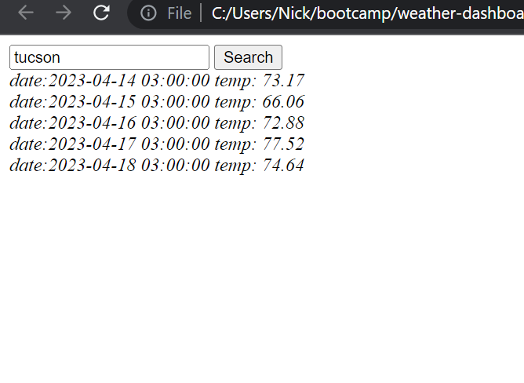

# Weather-Dashboard 

## Description

pulls up 5 day weather forcast based on the city you type in the search bar

## Table of Contents

- [Installation](#installation)
- [Usage](#usage)
- [License](#license)
- [Contributing](#contributing)
- [Tests](#tests)
- [Questions](#questions)

## Installation

none

## Usage

## License

No license

## Contributing

I worked wiht marcus Paccapaniccia https://github.com/Mpacct/

## Tests

no test

## Questions

Github username: [nickrosales](https://www.github.com/nickrosales)

Email: nickrosales68@gmail.com

link to github: https://github.com/nickrosales/weather-dashboard

link to deployed page: https://nickrosales.github.io/weather-dashboard/